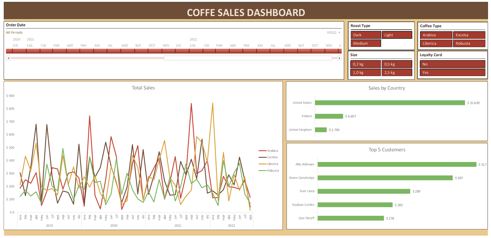

# COFFEE SALES DASHBOARD

## About This Project

This dashboard was created as part of a fictional case study to demostrate data visualization techniques. The data used in this project is entirely fictional.

The dataset was sourced from [Mo Chens Github Repository](https://github.com/mochen862/excel-project-coffee-sales/blob/main/coffeeOrdersData.xlsx) and modified to suit the context of this case.

## Objective

This dynamic dashboard was created to **analyze and visualize key sales metrics** for a coffee shop specializing in coffee beans. It enables stakeholders to explore performance trends, customer preferences, and geographic demand using interactive slicers to focus on specific product and customer characteristics.

## Key Features

1. **Dynamic Sales Trends**
    A line chart dynamically tracks sales trends for different coffee bean types (Arabica, Robusta, Excelsa, and Liberica) over time, helping identify seasonal patterns and changes in popularity.

2. **Sales by Country**
    A bar chart provides insights into revenue by country, revealing the most lucrative markets for coffee bean sales.

3. **Top Customers**
    A bar chart highlights the top 5 customers and their contributions to total revenue, with dynamic updates based on selected slicer filters.

4. **Interactive Slicers and TImeline**
    Slicers allow users to filter data by:
        - Coffee Type (Excelsa, Liberica, Arabica, Robusta)
        - Roast Type (Dark, Medium, or Light)
        - Size Type (0.2kg, 0.5kg, 1kg, 2.5kg)
        - Loyalty Card (Yes/No for customers enrolled in the loyalty program)
        - Time Period (selectable through a timeline feature that adjusts graphs dynamically to the chosen date range)
    These tools make the dashboard highly customizable, providing a detailed analysis of customer preferences, sales patterns, and performance trends over specific timeframes.

## What Users Can Learn from This Dashboard

- **Seasonal Sales Patterns**: Analyze trends over time to identify peak seasons for different coffee bean types and adjust marketing or inventory strategies accordingly.
- **Customer Preferences**: Understand customer behavior by filtering for roast type, package size, and loyalty card usage to discover which combinations are most popular.
- **Top Customer Insights**: Identify high-value customers and assess their purchasing patterns to plan targeted loyalty or retention campaigns.
- **Geographic Performance**: Explore sales by country to prioritize key markets and identify areas with growth potential.
- **Impact of Loyalty Programs**: Evaluate how loyalty card holders contribute to revenue and refine strategies for improving the effectiveness of the program.

## Files in this Repository

1. **Coffee_Sales_Dashboard.xlsx**: The final Excel file containing the dashboard and interactive data visualizations.
2. **coffeeOrdersData.xlsx**: The original fictional dataset used to create the dashboard.